# alice-n-bob: An Online Quantum Telegraph 

Hide your messages with the magic of QKD! or: How to do QKD on a single channel quantum computer

Note: A lot of work could be done to make this a cool project... please contact if interested. 

## Website

[`http://www.alice-n-bob.com`](http://www.alice-n-bob.com)

## Abstract
[`http://www.alice-n-bob.com`](http://www.alice-n-bob.com) is a website that allows you to generate a shared secret key between two people using quantum key distribution. The messenger (Alice) types in a random bitstring and their choice of measurement basis into the fields in the website. The bitstring is then measured in Alice's basis, and the output is sent to Alice in an email. Bob types his choice of measurement basis into the website, and an email is sent to him with the results of his measurement. Alice and Bob then share the results of their measurements, and discard the basis bits for which the measurements don't match. The remaining bits constitute the secret key to be used for messages.

## Motivation and Goals
Quantum Key Distribution is a provably secure encryption method, conditional only on the laws of physics and the hope that the hackers don't break into your house and demand your password. The goal of QKD is to create a secret key between two parties, Alice and Bob, that can then be used by both parites to encrypt and decrypt a hidden message. *Our* goal is to show the public that quantum computing is not science fiction--and not only that, but it can be used for something you care about: keeping your messages private.

## Our Team's Experience
This was a challenging but rewarding iQuHack for the QuackAttacks. In a short period of time, we learned Qiskit, Java, and HTML to the degree where we were able to implement an embedded Qiskit script in a webpage. With everyone working on a discrete part of the problem, it was difficult at first to organize and manage tasks. But by the end of the hackathon, we were operating as a team, and we're pretty proud of what we were able to accomplish.

## Implementation
For our demonstration, we will run two different encryption protocols: BB84 and E91. BB84 is more well-known, but it is likely that E91 is more useful in the real-world, as qubits can be exchanged remotely via entanglement.
### BB84 protocol
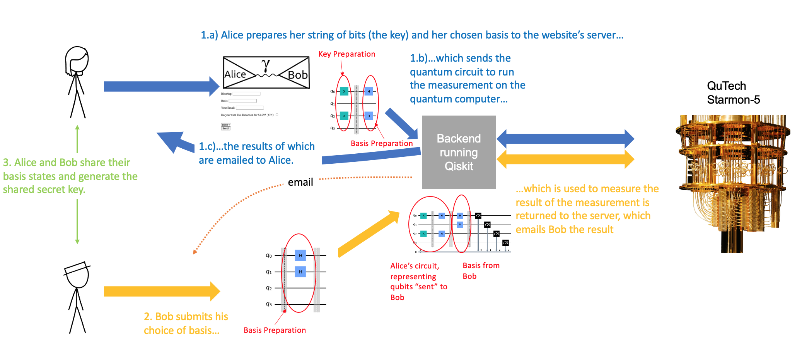

To interface with QuTech's quantum nodes, we set up a website. 
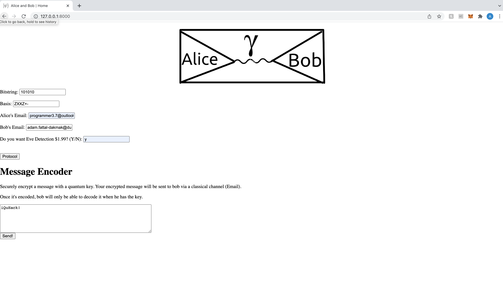
In order to generate a secret key, Alice inputs to the webpage:
* a five-digit bit string 
* a five-part basis state
* Bob's email address

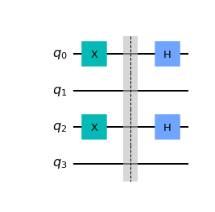
Using the first two inputs, the website submits to the quantum computer the quantum circuit, which simply operates Alice's basis state on the bit-string to perform a measuremen, the results of which are outputted in an email to Alice. Bob then inputs to the webpage only his five-part basis state, which then operates on Alice's qubits before being measured to generate a classical result, the results of which are emailed to Bob.

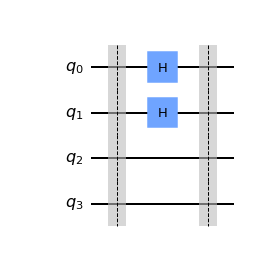

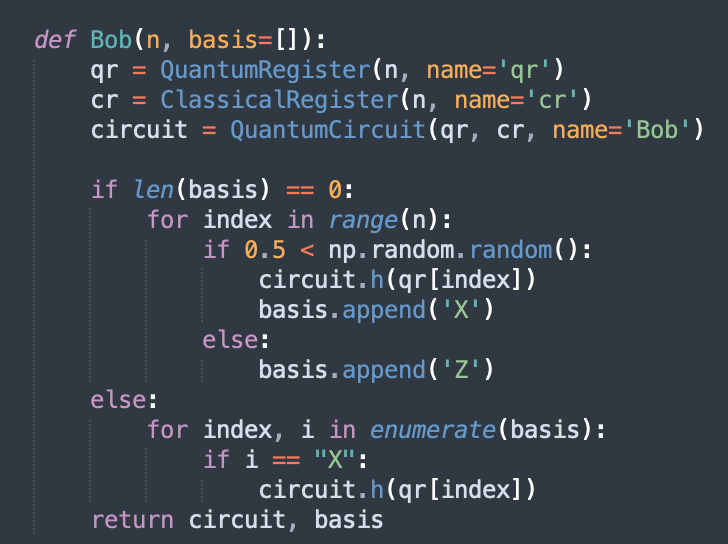
The email sent to Bob contains:

* Bob's measurement basis
* Bob's measurement output

Then Alice and Bob can communicate independently to discard mismatched bits and generate the shared secret key. This is the most cryptographically secure mode of operation of our BB84 protocol. For the purposes of our demonstration using the hardware on Starmon-5, we modified our code in the following ways:
* Bob's measurement basis was generated automatically using a random number generator, rather than input by Bob
* The email sent to Bob contains Alice's measurement basis and the shared secret key, in addition Bob's measurement basis and Bob's measurement output that was originally sent.


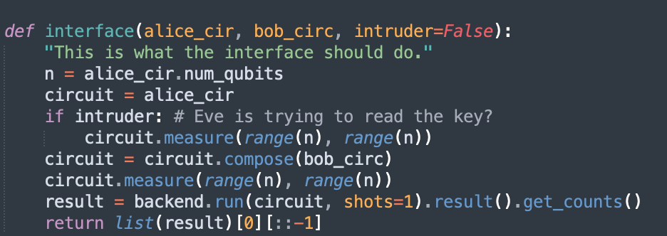
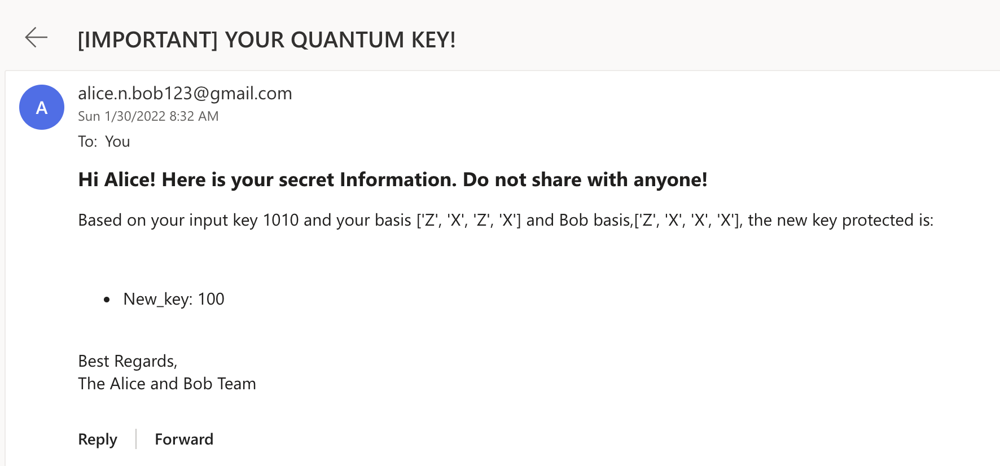
Although this protocol is technically insecure compared to our original implementation, as Bob's measurement basis and the shared secret key could be intercepted, it allows for a more convenient practical proof-of-concept demonstration, as a) we don't have to request that the Starmon-5 wait for Bob to input his measurement basis (which would risk us being timed out), and b) we needn't communicate independently via email in order to generate the shared key. Although we have modified the protocol for the purposes of this demonstration, it is trivial to revert the code back the more cryptographically secure version for actual encryption.

### E91 protocol
E91 quantum key distribution protocol is based on entanglement and CHSH inequality. Entangelment state will be referred as singlet state. Charlie, another third person who will create the entanglement state and will send the non-seperable quantum states to Alice and Bob using a quantum channel. For this case Charlie created 500 entanglement states.
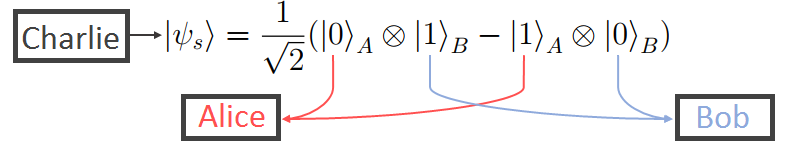

This entanglement states is incorporated with Qiskit SDK available in QuantumInspire
```ruby
from quantuminspire.qiskit import QI
email, password = "",""  # Insert email and password associated with quantuminspire account
QI.set_authentication_details(email=email, password=pasword)
backend = QI.get_backend('') # Choose the avialable simulator
```

After that, Alice and Bob will generate some bitstrings and measuer their projection based on the bitstrings. They will record their measurements and share them with using a classical communication channel. Based on the measurement projection they will generate a public key, otherwise it will be discarded. 
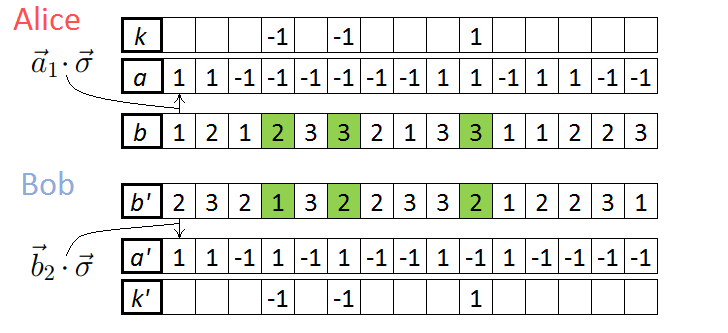. 

After public key is generated, Alice and Bob will calculate CHSH correlation value. If CHSH correlation value is -2.82842, then it can be said then entanglement property exists and Eve failed to intercept the quantum channel. With existence of Eve we found that our CHSH value is -2.853 adn there are no mismatching bits. 

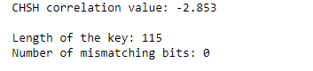


### Simulating Eve (hostile eavesdropping)
In order to demonstrate the security of our protocol, we simulate the operation of Eve, Alice and Bob's nefarious enemy and incurable gossip, who attempts to measure Alice's qubits before they reach Bob.
When Eve performs her measurements, she destroys the qubit. This will lead to errors in the eventual comparison of Alice and Bob's measurements. If more than half of the bits measured by Alice and Bob do not match, Alice and Bob are sent a message warning them that there communications have been intercepted and thus not to continue generated a shared key from this measurement.
To operate, you can type 'y' or 'n' in the box asking "Do you want Eve Detection $1.99?".

### Encryption and Decryption
For the sake of this demonstration, we implemented on our website an encryption/decryption functionality. The encryption method is simple: the key bits are added on top of the message. In our case, English was encoded in Morse code, and the key was much smaller than the message. Ideally, the message would be encoded with a scheme that allowed for more characters than Morse code, and the key would be as long as the message to provide maximum security. However, in our case, the key can only be 5 bits long, as we are using the Starmon-5 quantum computer.

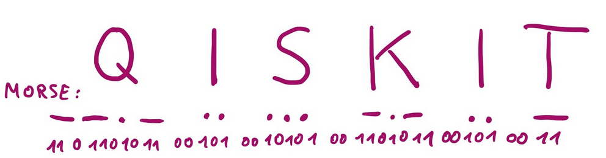
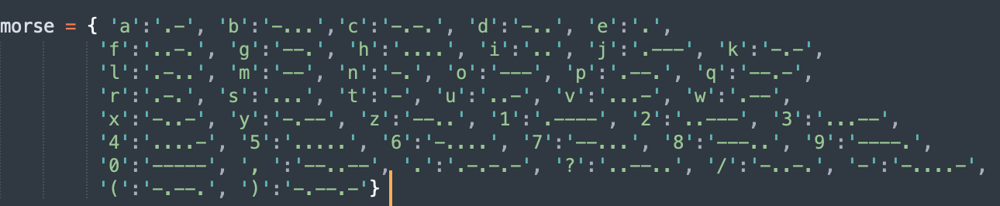

### iQuack
For a bit of fun, we implemented an app that allows you to generate your code as a serious of quacks and squeaks. Currently in beta.
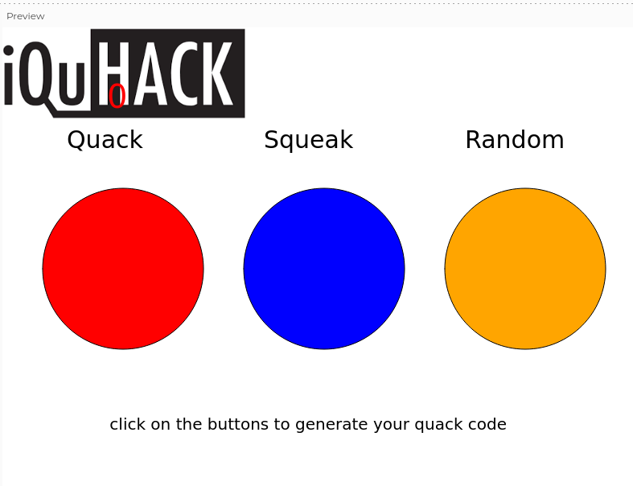
It runs in index.html in the directory DuckFinal_2022_01_30_15_46_33.

## Background
Let's walk through the steps of the BB84 protocol:

1. In the first step, Alice chooses two random bit strings, *k* and *b*, that each consist of *n* bits. Her bit string k contains the actual bits she wants to encode (out of which the key will later be formed), while *b* determines the bases in which she will encode her bits. For  (i.e., if the *i*th bit is zero), she encodes the *i*th qubit in the standard |0>, |1> basis, while for , she encodes it in the |+>, |-> basis, where |+>:=1/√2(|0>+|1>), |->:=1/√2(|0> -|1>). 
This becomes more illustrative when representing each basis by two perpendicular arrows, where the two different bases are rotated by .
The encoding of each qubit  would therefore look like the following:


2. After encoding her *n* qubits, Alice sends these qubits to Bob. Bob also chooses a random bit string  consisting of *n* bits that determines in which bases he is going to perform measurements. He stores the outcomes of his measurements  together with the corresponding basis bits  in a table.

3. Next, Alice and Bob compare their basis bits  and . Whenever , Bob measured in a different basis than Alice's qubit was encoded in, so he gets each outcome with probability 1/2. Alice and Bob therefore discard all key bits corresponding to these basis bits. If , however, they prepared and measured the qubit in the same basis, so (unless someone eavesdropped) Bob will get the key bit that Alice encoded, . These outcomes then compose the key.

### An illustrated example

Suppose Alice's random bit strings are k=`0111001` and b=`1101000` and Bob's random bit string is . Look at the other entries in the table below. Note that in the case where the basis bits are different, Bob has a 50% chance to get each outcome, so here one of them was chosen randomly.


The key produced in this example would be '0110'. To make sure that the key is secret and correct, Alice and Bob would "sacrifice" some of their key bits to check that no one eavesdropped. If someone had measured a qubit on the way, this could have changed the state of that qubit and with probability 1/4, Bob's and Alice's key bits will be different. By checking *m* bits, the probability to not notice an eavesdropper decreases as . Thus, if they check enough bits and they are all the same, they can assume that no one eavesdropped and their key is secret. However, to keep things simple, we will not perfom these tests in this excercise. Instead, all bits of the key will be used.

### Message encrpytion
Once a secret key is distributed, Alice can encrypt her message by using the so-called [one-time pad](https://en.wikipedia.org/wiki/One-time_pad) technique: she simply adds the key bits on top of her secret message bits that she wants to send. Using the example above, her key is  `0110`. If her secret message bit string is m=`1100`, the encrypted message will be  `1010`. Bob can then decrypt the message by adding his key on that encrypted message, .
